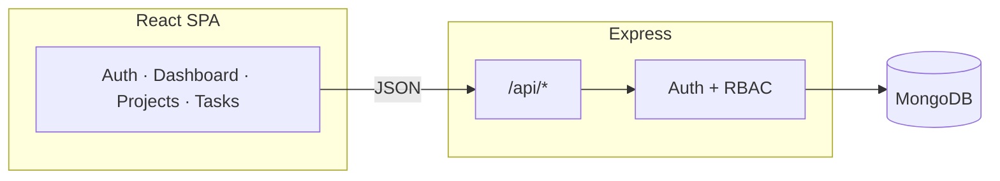

<div align="center">

# Team Task Manager

**Projects · tasks · roles · dashboards — full-stack MERN-style app.**

[](https://nodejs.org/)
[](https://react.dev/)
[](https://expressjs.com/)
[](https://www.mongodb.com/)
[]()

<br />

[Features](#features) · [Quick start](#quick-start) · [API](#api-reference) · [Deploy](#deploy-railway) · [Structure](#repository-layout)

</div>

---

## Overview

Full-stack app for **multi-project collaboration**: sign up, create projects, invite teammates by email, manage **tasks** (status + due dates), and use a **personal dashboard** (assigned work, status mix, overdue). **JWT** auth and **Admin / Member** roles per project.

| | |
|---:|---|
| **Backend** | `backend/` — Express 4, Mongoose, express-validator, RBAC middleware |
| **Frontend** | `frontend/` — React 18, Vite, React Router, dark UI |
| **Deploy** | Single Node process serves API + built SPA → **Railway**-friendly (`Dockerfile`) |

> **After you deploy:** add your live URL here → `https://your-app.up.railway.app`

---

## Features

| Area | What you get |
|------|----------------|
| **Auth** | Register / login, bcrypt passwords, Bearer JWT |
| **Projects** | Create workspace, you become **Admin**; list memberships |
| **Team** | Admins add members by **email** (must be registered), change roles |
| **Tasks** | Todo / in progress / done, assignee, due date, project-scoped rules |
| **Dashboard** | Tasks **assigned to you** across projects + overdue + status counts |
| **RBAC** | Admins: members + project delete; members: scoped task edits (see below) |

<details>
<summary><strong>RBAC summary (click to expand)</strong></summary>

| Action | Admin | Member |
|--------|:-----:|:------:|
| View project / tasks / members | ✓ | ✓ |
| Create task | ✓ | ✓ |
| Update / delete **any** task | ✓ | — |
| Update **some** tasks | ✓ | ✓ if creator, assignee, or **unassigned** |
| Delete task | ✓ | ✓ if creator **or** assignee |
| Members / roles / delete project | ✓ | — |

</details>

---

## Quick start

**Needs:** Node 18+, MongoDB ([local](https://www.mongodb.com/docs/manual/installation/) or [Atlas](https://www.mongodb.com/cloud/atlas)).

```bash
# 1. Env (copy and edit MONGODB_URI + JWT_SECRET)
cp backend/.env.example backend/.env

# 2. Install both packages
npm run setup

# 3. Terminal A — API (port 4000)
cd backend && npm run dev

# 4. Terminal B — UI (port 5173, proxies /api → 4000)
cd frontend && npm run dev
```

Open **http://localhost:5173** · Health: `GET http://localhost:4000/health` → `{ "ok": true }`

<details>
<summary><strong>Production smoke test (local)</strong></summary>

```bash
npm run setup && npm run build
export NODE_ENV=production
export MONGODB_URI="your-uri"
export JWT_SECRET="long-random-secret"
export CLIENT_URL="http://localhost:4000"
node backend/src/server.js
```

Then open **http://localhost:4000** (same origin: UI + `/api`).

</details>

---

## Tech stack

| Layer | Choice |
|-------|--------|
| **API** | Express 4 — small surface, easy to review |
| **DB** | MongoDB + Mongoose — refs + validations |
| **Auth** | JWT (Bearer) + bcrypt |
| **UI** | React 18 + Vite + React Router 6 |
| **Validation** | express-validator on REST inputs |

### Architecture



In **production**, `NODE_ENV=production` serves **`frontend/dist`** from the API (set **`CLIENT_URL`** to your public origin for CORS).

---

## Data model

- **User** — unique `email`, `passwordHash`, `name`
- **Project** — `name`, `description`, `createdBy`
- **ProjectMember** — `project`, `user`, `role`: `ADMIN` \| `MEMBER` (unique pair)
- **Task** — `project`, title, description, `status`: todo \| in_progress \| done, `dueDate`, `assignee`, `createdBy`

Business rules enforced in handlers (e.g. assignee must be a member).

---

## API reference

Base path: **`/api`**

<details>
<summary><strong>Auth</strong></summary>

| Method | Path | Body |
|--------|------|------|
| `POST` | `/auth/register` | `{ email, password, name }` |
| `POST` | `/auth/login` | `{ email, password }` |
| `GET` | `/auth/me` | Bearer token |

</details>

<details>
<summary><strong>Projects & members</strong> (Bearer)</summary>

| Method | Path | Notes |
|--------|------|--------|
| `GET` | `/projects` | Your projects + role |
| `POST` | `/projects` | Create — you become Admin |
| `GET` | `/projects/:id` | Member |
| `PATCH` | `/projects/:id` | Admin |
| `DELETE` | `/projects/:id` | Admin — cascades tasks + members |
| `GET` | `/projects/:id/dashboard` | Counts + overdue |
| `GET` | `/projects/:id/members` | List |
| `POST` | `/projects/:id/members` | Admin — `{ email, role? }` |
| `PATCH` | `/projects/:id/members/:userId` | Admin — `{ role }` |
| `DELETE` | `/projects/:id/members/:userId` | Admin |

</details>

<details>
<summary><strong>Tasks</strong> (Bearer, project member)</summary>

| Method | Path |
|--------|------|
| `GET` | `/projects/:id/tasks` |
| `POST` | `/projects/:id/tasks` — `{ title, description?, status?, assigneeId?, dueDate? }` |
| `GET` | `/projects/:id/tasks/:taskId` |
| `PATCH` | `/projects/:id/tasks/:taskId` |
| `DELETE` | `/projects/:id/tasks/:taskId` |

</details>

<details>
<summary><strong>Dashboard</strong></summary>

| Method | Path | Result |
|--------|------|--------|
| `GET` | `/dashboard` | Assigned-to-you tasks + summary (status + overdue) |

</details>

**Errors:** `400` validation · `401` auth · `403` forbidden · `404` · `409` duplicate member · `500`

---

## Deploy (Railway)

**Option A — Dockerfile (recommended)**

1. MongoDB (Railway plugin or Atlas) → copy `MONGODB_URI`.
2. New service from this repo; use repo **`Dockerfile`**.
3. Set env: `MONGODB_URI`, `JWT_SECRET`, `CLIENT_URL` (your `https://…railway.app`), `PORT` if needed.
4. Start command is already **`node backend/src/server.js`** (see `Dockerfile`).

**Option B — Nixpacks**

**Build:**
```bash
(cd backend && npm install) && (cd frontend && npm install && npm run build)
```
**Start:**
```bash
NODE_ENV=production node backend/src/server.js
```

---

## Repository layout

```
Team Task Manager/
├── backend/                 # Express API (src/server.js, modules/, models/)
├── frontend/               # Vite + React (@/ alias → src/)
├── docs/PROJECT_STRUCTURE.md
├── Dockerfile
└── package.json            # npm run setup | build | start
```

Never commit **`backend/.env`** — keep **`backend/.env.example`** for others.

More detail: **`docs/PROJECT_STRUCTURE.md`**.

---

## Interview one-liner

> Users authenticate once. Each **project** has **memberships with roles**. Admins manage people and destructive actions; **tasks** reference project, assignee, and creator. **MongoDB** stores documents with ObjectId refs; **Express** validates and enforces RBAC; **React** consumes JSON. One Node process can host API + SPA for simple hosting.

---

## Security notes

- Passwords hashed with **bcrypt** — never plain text.
- JWT demo expiry **7d** — production would use shorter access tokens or refresh flow.
- Project routes always resolve **membership** before mutations.
- **Last admin** cannot be removed/demoted without another admin.

---

## Roadmap ideas

- Refresh tokens · email verification · password reset  
- Pagination & search on tasks  
- Audit log · E2E (Playwright) · API tests (supertest)

---

<div align="center">

**Private / assessment use — swap in MIT or Apache-2.0 if you open-source it.**

</div>
