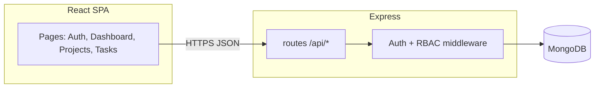

# Team Task Manager

Full-stack web app for **multi-project collaboration**: sign up, create projects, invite teammates, manage tasks with statuses and due dates, and see a **personal dashboard** (assigned work, status mix, overdue). Access is enforced with **JWT authentication** and **Admin / Member** roles on each project.

Built to match a typical take-home brief: REST API, persistent database with clear relationships, validation, RBAC, and a deployable single service (API + built React app).

---

## How to explain this in an interview (elevator pitch)

> “Users authenticate once; every project has a membership record with a role. Admins own project settings and membership; everyone in the project can work on tasks, with extra edit rules so members cannot override arbitrary work. Tasks live in MongoDB with references to project, assignee, and creator; the dashboard aggregates assignments across projects with simple status and overdue counts. The API is Express + Mongoose with express-validator on inputs; the client is React with a thin `fetch` wrapper. In production one Node process serves the SPA and the `/api` routes, so Railway only needs one service plus Mongo.”

---

## Tech stack

| Layer | Choice | Why |
|--------|--------|-----|
| API | **Express 4** | Small surface area, easy to walk through in an interview |
| DB | **MongoDB** + **Mongoose** | NoSQL allowed by the brief; ObjectId refs model relationships |
| Auth | **JWT** (Bearer) + **bcrypt** password hashing | Stateless API, simple for SPAs |
| Client | **React 18** + **Vite** + **React Router 6** | Fast dev/build, predictable routing |
| Validation | **express-validator** | Server-side validation aligned with REST errors |

---

## Architecture (high level)



**Production**: `NODE_ENV=production` enables static serving from `frontend/dist` and SPA fallback so the same origin loads UI and `/api/*` (no CORS pain if `CLIENT_URL` matches the public Railway URL).

**Development**: Vite dev server proxies `/api` → `localhost:4000` (see `frontend/vite.config.js`).

---

## Data model (collections)

- **User** — `email` (unique), `passwordHash`, `name`
- **Project** — `name`, `description`, `createdBy` → User
- **ProjectMember** — `project`, `user`, `role` (`ADMIN` \| `MEMBER`); unique `(project, user)`
- **Task** — `project`, `title`, `description`, `status` (`todo` \| `in_progress` \| `done`), `dueDate`, `assignee` → User (optional), `createdBy` → User

Relationships are enforced at the API layer (e.g. assignee must be a project member; only members see a project).

---

## Role-based access (RBAC)

| Action | Admin | Member |
|--------|-------|--------|
| View project / tasks / members | Yes | Yes |
| Create task | Yes | Yes |
| Update / delete **any** task | Yes | No* |
| Update **some** tasks | Yes | Yes if creator, assignee, or task is **unassigned** |
| Delete task | Yes | Yes if creator **or** assignee |
| Add / remove members, change roles | Yes | No |
| Edit project name/description, delete project | Yes | No |

\*Full update/delete power is reserved for admins; members have scoped edit rights so the rules are easy to defend in an interview without a huge policy matrix.

---

## REST API overview

Base path: `/api`

**Auth**

- `POST /auth/register` — `{ email, password, name }`
- `POST /auth/login` — `{ email, password }`
- `GET /auth/me` — Bearer token

**Projects** (Bearer)

- `GET /projects` — projects you belong to + your `role`
- `POST /projects` — create (you become `ADMIN`)
- `GET /projects/:id` — details (member)
- `PATCH /projects/:id` — admin
- `DELETE /projects/:id` — admin (cascade members + tasks)
- `GET /projects/:id/dashboard` — project-wide counts + overdue
- `GET /projects/:id/members` — list
- `POST /projects/:id/members` — admin — `{ email, role? }` (user must already be registered)
- `PATCH /projects/:id/members/:userId` — admin — `{ role }`
- `DELETE /projects/:id/members/:userId` — admin (cannot remove last admin)

**Tasks** (Bearer, must be project member)

- `GET /projects/:id/tasks`
- `POST /projects/:id/tasks` — `{ title, description?, status?, assigneeId?, dueDate? }`
- `GET /projects/:id/tasks/:taskId`
- `PATCH /projects/:id/tasks/:taskId`
- `DELETE /projects/:id/tasks/:taskId`

**Dashboard**

- `GET /dashboard` — tasks **assigned to you** across all projects + `summary` (counts, overdue)

Errors: `400` validation, `401` auth, `403` forbidden, `404` not found, `409` conflict (e.g. duplicate member), `500` unexpected.

---

## Local development

**Prerequisites**: Node 18+, MongoDB reachable at a URI (local or [MongoDB Atlas](https://www.mongodb.com/cloud/atlas)).

1. **Environment — API**

   ```bash
   cp backend/.env.example backend/.env
   # edit MONGODB_URI and JWT_SECRET
   ```

2. **Install**

   ```bash
   npm run setup
   ```

3. **Run (two terminals)**

   ```bash
   cd backend && npm run dev
   ```

   ```bash
   cd frontend && npm run dev
   ```

4. Open `http://localhost:5173` — API calls go through the Vite proxy to port `4000`.

**Health check**: `GET http://localhost:4000/health` → `{ "ok": true }`

---

## Production build (local smoke test)

```bash
npm run setup
npm run build
export NODE_ENV=production
export MONGODB_URI="your-uri"
export JWT_SECRET="long-random"
export CLIENT_URL="http://localhost:4000"
node backend/src/server.js
```

Visit `http://localhost:4000` — static UI + `/api/*` on the same host.

---

## Deploy on Railway

You can use **Dockerfile** (recommended for reproducible builds) or Nixpacks with custom commands.

### Option A — Dockerfile

1. Create a **MongoDB** instance (Railway plugin, Atlas, etc.) and copy the connection string.
2. New Railway service from this repo; set **builder** to Dockerfile (or let Railway auto-detect).
3. **Variables**:

   | Variable | Example |
   |----------|---------|
   | `MONGODB_URI` | `mongodb+srv://...` |
   | `JWT_SECRET` | long random string |
   | `CLIENT_URL` | `https://YOUR-RAILWAY-APP.up.railway.app` |
   | `PORT` | usually injected by Railway — keep default if platform sets it |

4. **Port**: expose the HTTP port Railway assigns (app listens on `process.env.PORT`).

The image runs `node backend/src/server.js` after building the SPA into `frontend/dist`.

### Option B — Nixpacks / Node**

Set **build** roughly to:

```bash
(cd backend && npm install) && (cd frontend && npm install && npm run build)
```

Set **start** to:

```bash
NODE_ENV=production node backend/src/server.js
```

Point `CLIENT_URL` at your Railway public HTTPS URL so CORS matches if you ever split frontend and API.

---

## Repository layout (`backend/` + `frontend/`)

Two top-level folders — **`backend`** (API + MongoDB) and **`frontend`** (React SPA). The API serves **`frontend/dist`** when `NODE_ENV=production`.

- **`backend`** — Express + Mongoose (REST).
- **`frontend`** — Vite + React; production build consumed by `backend`.

Inside each folder, code follows the same layered layout as before (API: `modules/`, middleware, models; web: `@/` aliases). See **`docs/PROJECT_STRUCTURE.md`**.

```
Team Task Manager/
├── backend/                          # API package — npm manifest + src/
│   └── src/
│       ├── server.js
│       ├── app/create-app.js
│       ├── config/database.js
│       ├── middleware/
│       ├── lib/
│       ├── database/models/
│       └── modules/                  # auth, dashboard, projects (+ tasks)
├── frontend/                         # Web package — Vite + React
│   ├── vite.config.js
│   └── src/                         # app/, layouts/, pages/, providers/, shared/, styles/
├── docs/PROJECT_STRUCTURE.md
├── Dockerfile                        # Builds frontend → runs backend
└── package.json                      # Convenience scripts → backend / frontend
```

---

## Security & validation notes (good interview talking points)

- Passwords are **never** stored plain text (`bcryptjs`).
- JWT is short-lived **7 days** for demo convenience — production would use refresh tokens or shorter access tokens.
- All project-scoped routes load **membership** and apply **admin-only** flags per handler.
- **Mongoose** schema enums + **express-validator** on inputs reduce bad data at the boundary.
- **Last admin** cannot be demoted or removed without promoting someone else first.

---

## What I would improve next (if asked)

- Refresh tokens, email verification, password reset
- Pagination on task lists; search/filter API
- Activity log / audit trail
- E2E tests (Playwright) and API tests (supertest)
- Stricter member task policy if the product needs it (policy as config)

---

## License

Private / assessment use — adjust as needed.
